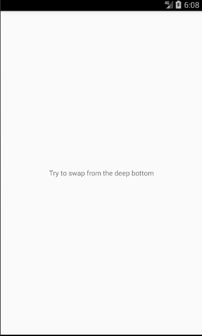

# React Native Vertical Swipe
Vertical swipe for react-native



## Installation
̀`npm install --save react-native-vertical-swipe`

## Usage
```javascript
import React, { Component } from 'react';
import { StyleSheet, ScrollView, Text, View } from 'react-native';
import VerticalSwipe from 'react-native-vertical-swipe';

const styles = StyleSheet.create({
  container: {
    flex: 1,
  },

  dragContainer: {
    flex: 1,
    alignItems: "center",
    justifyContent: "center",
  },

  innerContainer: {
    backgroundColor: "white",
  },

  innerText: {
    padding: 20,
  }
});

class Scene extends Component {
  render() {
    return (
      <View style={styles.container}>
        <VerticalSwipe
          style={styles.dragContainer}
          content={(
            <View style={styles.innerContainer}>
              <ScrollView>
                <Text style={styles.innerText}>
                  Lorem ipsum dolor sit amet, consectetur adipiscing elit. Nunc mollis rhoncus sapien, sed aliquet tellus viverra porta. Aliquam quis elit vel enim mattis sollicitudin ac a purus. Maecenas sed neque blandit, egestas nulla in, ullamcorper ipsum. Duis turpis dolor, ultricies nec euismod ut, sodales vitae nibh. Nullam quis mi vitae nibh pellentesque malesuada. Duis quis pellentesque nulla. Sed orci velit, faucibus at tellus id, tempus luctus nibh. Nullam eleifend quis dui eu mollis. Maecenas rutrum, arcu et dignissim rutrum, odio mauris molestie eros, non gravida eros libero pharetra elit. Quisque libero mauris, aliquam eu lacinia non, sodales eu urna. Curabitur vestibulum, felis at lacinia iaculis, nulla lectus congue nulla, id consectetur metus lacus sit amet eros. Duis sit amet leo mi. Mauris id mi ut augue aliquet luctus eget vel odio. Nam placerat efficitur malesuada. Integer dictum lorem ut interdum consequat. Aenean porttitor sapien quis risus egestas tempor.
                  Duis ut egestas nisl, quis lacinia mauris. Nullam maximus nisl vel finibus tincidunt. Maecenas sollicitudin felis massa. Class aptent taciti sociosqu ad litora torquent per conubia nostra, per inceptos himenaeos. Vivamus sit amet posuere leo. In hac habitasse platea dictumst. Proin egestas varius nibh. Pellentesque vitae nisl consectetur, varius elit non, ullamcorper odio.
                  Etiam enim massa, imperdiet nec lectus id, vestibulum varius enim. Vestibulum id leo nec nulla pellentesque interdum a non odio. Praesent sed cursus quam. Proin pulvinar odio vitae sapien volutpat vulputate. Vestibulum egestas purus a molestie ultrices. Lorem ipsum dolor sit amet, consectetur adipiscing elit. Orci varius natoque penatibus et magnis dis parturient montes, nascetur ridiculus mus. Sed ultricies quam id augue aliquam egestas sit amet quis odio.
                  Aliquam elementum malesuada turpis sit amet dignissim. Ut feugiat augue id est pharetra pharetra. Curabitur dictum pellentesque erat, id imperdiet dui facilisis nec. Proin nisi ante, aliquam at ipsum et, pharetra efficitur ante. Integer aliquam ipsum a sagittis pharetra. Nulla nulla ex, sodales in metus a, euismod accumsan turpis. Ut placerat placerat enim sit amet hendrerit. Vivamus porttitor sit amet lorem ut tincidunt. Nulla facilisi. Nullam vel mi in turpis sollicitudin hendrerit. Nam suscipit, metus in blandit suscipit, nunc sapien molestie justo, a aliquam tortor eros sed dolor. Duis vestibulum tellus nisi, at pharetra turpis fringilla hendrerit. Duis pharetra nulla vel molestie lobortis.
                </Text>
              </ScrollView>
            </View>
          )}>
          <Text style={styles.text}>Try to swap from the deep bottom</Text>
        </VerticalSwipe>
      </View>
    );
  }
}

export default Scene;
```

## Props

- `swipeOffset` (default: 100) : the amount of pixel the user can use to swipe from the bottom of the screen
- `openSwipeThreshold` (default: 100) : threshold after which we consider the user wants to open the view (will trigger the animation)
- `closeSwipeThreshold` (default: 50) : same, but to the bottom. Note that the threshold starts from the view and not the screen, which means that
if you put an offsetTop, you wont be able to trigger it from above the view
- `offsetTop` (default: 0) : the view will goes up to that amount of pixel
- `startOpened` (default: false) : the swipe will be opened when rendering first

## Work to do
- Smoother animation : when the user releases, the animation starts with a null speed, which isn't really fluid enough
- Refactor : the code can really look better, did it really fast
- Propose an option to allow swiping from above the offsetTop
- Propose an option that allow pushing the current content when swiping (instead of going over it)